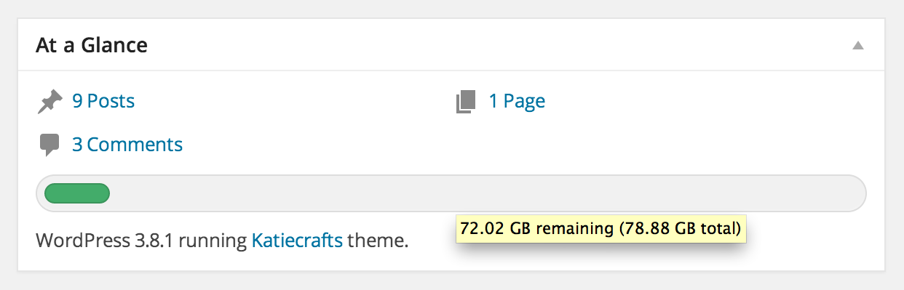
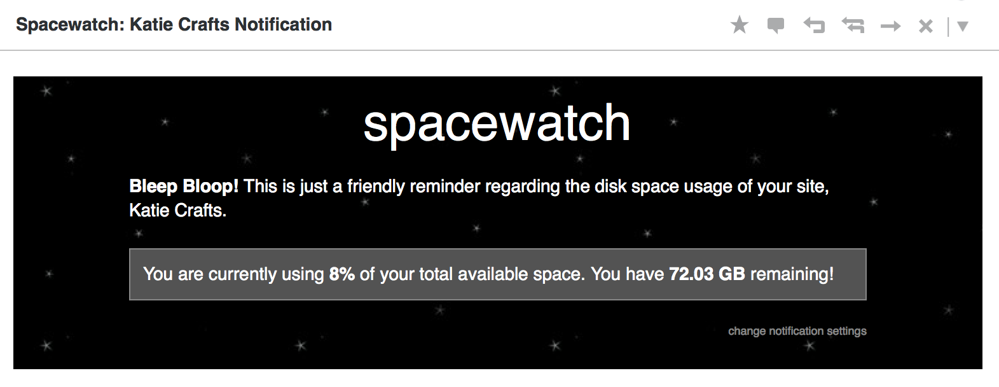
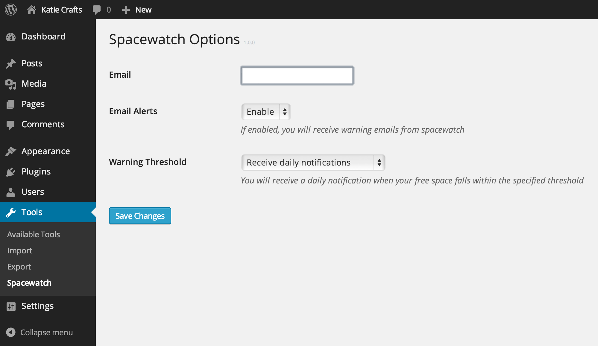

# Spacewatch

### Monitor the available free space on your server with a dashboard widget and optional notification that gets sent when you reach a specified threshold

## Description

Spacewatch gives you a breakdown of the total space available on your server right from your dashboard by appending a small progress bar right to the *At a Glance* widget.

You can also completely configure the notification email:
* Receive daily alerts regardless of warning level
* Receive daily alerts once you have 41%-60% free space remaining
* Receive daily alerts once you have 21%-40% free space remaining
* Receive daily alerts once you have 0%-20% free space remaining

## Installation

1. Upload the `spacewatch` folder to the `/wp-content/plugins/` directory
1. Activate spacewatch through the 'Plugins' menu in WordPress
1. (optional) Enable the At a Glance dashboard widget

Once you've completed those steps, you will be able to view the Spacewwatch widget right from your dashboard

## Frequently Asked Questions

### I don't see the progress bar on my dashboard... where is it?

Make sure that you have enabled the *At a Glance* dashboard widget. Once you've activated it, the progress bar will be appended to it right after the post counts.

### I found a bug! What do I do?

Feel free to post any bugs, feature requests or comments on the [Spacewatch Issues](https://github.com/seriouslysean/spacewatch/issues) page and I'll get to them as soon as I'm able!

## Screenshots

The dashboard widget fits in with any theme and will change color based on your warning level. Hovering will show you the free space currently available.

Email notifications can be enabled or disabled from the Tools > Spacewatch options page.

This is what the notification email looks like. The Spacewatch Robot cares.

## Changelog

### 1.0.0

* Initial release

## Upgrade Notice
